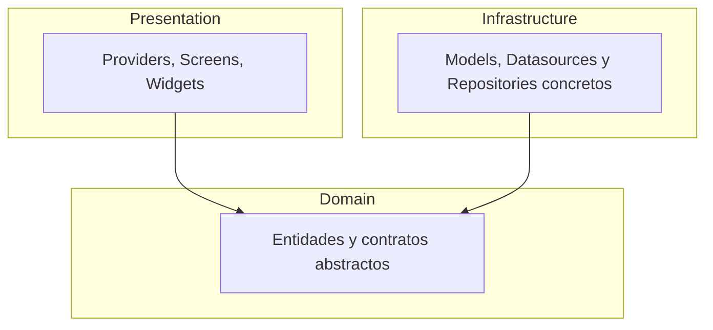

# DartTok 🎥


Un clon simplificado de TikTok construido con Flutter, con feed vertical infinito, reproducción automática de video y arquitectura limpia (domain / infrastructure / presentation). Los videos se consumen en tiempo real desde la [API de Pixabay](https://pixabay.com/api/docs/), con un respaldo local automático si la API no responde.

**🔗 Demo en vivo (Web):** https://victor-jr-805.github.io/darttok/

## 📸 Demostración de funcionamiento

<p align="center">
  
</p>

## 📥 Descargas

Las últimas versiones compiladas están disponibles en la sección [Releases](https://github.com/victor-jr-805/darttok/releases) de este repositorio:

- **Android:** `app-release.apk`
- **Windows:** `darttok-windows.zip`
- **Linux:** `darttok-linux.tar.gz`
- **Web:** sin descarga necesaria, corre directo en el link de arriba

> **iOS:** el proyecto compila correctamente para iOS dentro del pipeline de CI (ver workflow `Release`, job `build-ios-demo`), pero no se distribuye un build firmado — eso requiere una cuenta de Apple Developer de pago.

## ✨ Funcionalidades

- Feed vertical infinito estilo TikTok, con paginación real contra la API de Pixabay
- Reproducción automática con pausa al salir de pantalla y play/pause al tocar
- Likes interactivos con animación y formato de números legible (`1.23M`, `4.5K`)
- Manejo de errores con reintento, y respaldo automático a datos locales si la API falla
- Tema oscuro Material 3 generado a partir de un solo color semilla
- Multiplataforma: Android, Web, Linux y Windows desde el mismo código

## 🏗️ Arquitectura



`Presentation` e `Infrastructure` dependen de `Domain`; `Domain` no depende de nada. Esto permite alternar entre el datasource remoto (Pixabay) y uno local (usado en tests) sin tocar ni el Provider ni la UI.

## 🧱 Stack técnico

| Categoría | Herramienta |
|---|---|
| Framework | Flutter 3.47.1 / Dart 3.13.1 |
| Estado | Provider |
| HTTP | Dio |
| Video | video_player + fvp (soporte de Linux/Windows) |
| Datos | API de Pixabay (videos) |
| Testing | flutter_test + mocktail |
| CI/CD | GitHub Actions |

## 🚀 Correr el proyecto localmente

1. Clona el repositorio:
   ```
   git clone https://github.com/victor-jr-805/darttok.git
   cd darttok
   ```
2. Copia el archivo de ejemplo de variables de entorno y coloca tu propia API key gratuita de Pixabay ([pixabay.com/api/docs](https://pixabay.com/api/docs/)):
   ```
   cp env/pixabay.example.json env/pixabay.json
   ```
3. Instala dependencias:
   ```
   flutter pub get
   ```
4. Corre en la plataforma que quieras:
   ```
   flutter run -d linux   --dart-define-from-file=env/pixabay.json
   flutter run -d chrome  --dart-define-from-file=env/pixabay.json
   flutter run            --dart-define-from-file=env/pixabay.json   # dispositivo/emulador Android
   ```

## ✅ Testing

```
flutter test
```

17 tests cubriendo el mapper de Pixabay (parseo defensivo de JSON malformado), el `ForYouProvider` (paginación, duplicados, manejo de errores, con un repositorio falso) y los botones de interacción.

## ⚠️ Limitaciones conocidas

- Los likes son una simulación visual (actualización optimista local) — Pixabay no ofrece un endpoint real de "me gusta", así que no persisten entre videos ni entre sesiones
- La API key gratuita queda embebida en el bundle compilado de Web y Android; es un riesgo aceptado porque no tiene facturación asociada, solo un límite compartido de peticiones por minuto

## 👤 Autor

**Victor** — [@victor-jr-805](https://github.com/victor-jr-805)

## 📄 Licencia

_Pendiente de elegir — ver sección de sugerencias más abajo en la conversación._
